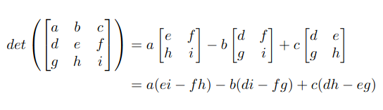

# Recursive Determinant Calculator

This code finds the determinant of square matrices by reducing the size of the matrix from NxN to (N-1)x(N-1), until the final matrix is 2x2. (Using recursion is inefficient and slow for actually computing determinants, use some online tool instead. I wrote it just for the fun of doing it recursively)

My favorite algorithm for finding the determinant of matrices, is using [Laplace Expansion](https://en.wikipedia.org/wiki/Laplace_expansion). For matrices bigger than $3\times 3$, it is very boring to do, but usually doesn't need as much brainpower as other methods.

As it's my favorite method, i tried to code a program that finds the determinant by doing it using said method. (It also uses recursion, which i find really cool, even though i am great at breaking things with it.)

## Example of Laplace Expansion

To better illustrate how to program works, we are going to compute the determinant of a general $3\times 3$ matrix below:

Doing the same thing with a 4x4 matrix, would first reduce every matrix to 3x3, and then to calculate its determinant, reduce it further to 2x2.

The basic idea is: 'Hold' the term $A_{11}$, and multiply it by the determinant of the reduced matrix M, where M is the resulting matrix of 'deleting' the first row and column of the original matrix, A.

Then, you do it for all the terms on the first row, but alternate the signs. In the end you should have:
$det(A) = A_{11}det(M^{11}) - A_{22}det(M^{22}) + ... + A_{nn}det(M^{nn})$

### Some additional stuff to change on the functions file

Running the code as is, will compute the determinant of some random matrix, without showing you the 'sub-matrices', which makes this code basically pointless and inefficient, since there are quicker and easier algorithms to compute the determinant.

If you want to see the sub-matrices, open the 'determinant_functions.py' file, and uncomment the `print` statement on line 35.

Also, if you, for some reason wants to use this code to compute your determinants, you should change the matrix first, by uncommenting the 'matrix_to_calculate' and changing it as you wish.

## Running the code

Since it is not very useful outside of having fun with it, i don't think i'll be developing some sort of GUI, or easier-to-use way to run it, so for the time, we'll have to stick with changing the source code and running it with your favorite IDE/Editor/Terminal.

To run it from terminal, try:
`
$ python determinant_calculator.py
`
Or
`$ python3 determinant_calculator.py`